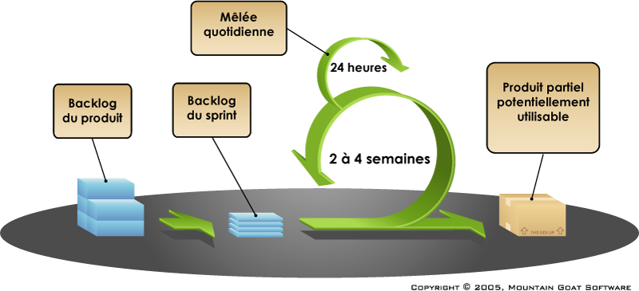
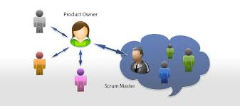
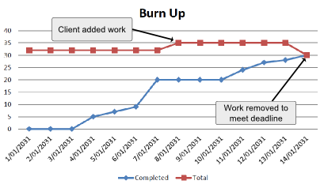
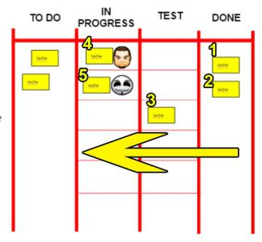

# Methode Agile : Scrum.

# 1. Définition :
   
    Scrum est un schéma d’organisation de développement de produits complexes. Il est défini par ses créateurs comme un « cadre de travail holistique itératif qui se concentre sur les buts communs en livrant de manière productive et créative des produits de la plus grande valeur possible »1. Scrum est considéré comme un groupe de pratiques répondant pour la plupart aux préconisations du Manifeste Agile.

    La méthode Scrum (« Scrum » signifie « Mêlée » en anglais), ou plus exactement le cadre méthodologique Scrum est de loin la méthode Agile la plus utilisée dans le monde. Expérimentée en 1993, elle bénéficie aujourd’hui de nombreux retours d’expérience. Les conférences, communautés, formations, blogs, outils et ouvrages à son sujet ne manquent pas.

[wikipédia](https://fr.wikipedia.org/wiki/Scrum_(d%C3%A9veloppement)) - Scrum (développement)

# 2. Trois rôles :
    Chacun de ces rôles a un ensemble défini de responsabilités et ce n'est que s'ils s'acquittent de ces responsabilités, interagissent étroitement et travaillent ensemble, qu'ils peuvent mener à bien un projet.

  
Scrum Roles & Stakeholders

1. Product Owner
   Le product owner – ou PO - est responsable de la définition et de la conception d'un produit. Il est chargé de mener à terme un projet en utilisant la méthode scrum*. Aussi appelé chef de projet digital, il est organisé et très rigoureux
2. Scrum master
 la MOE répond à la spec générale de la MOA par une spec détaillée et l'interprétation de générale et détaillée est très variable.
 Le rôle de Scrum Master est de s'assurer de l'implication de chaque membre et de les aider à franchir les différents obstacles qu'ils pourraient rencontrer. Comme un coach, le Scrum Master n'a pas vocation à résoudre directement les problèmes, mais à aider son équipe dans la recherche et l'identification de solutions.
3. Scrum team
Dans le cadre Scrum, tout le travail fourni au client est effectué par des équipes Scrum dédiées. Une équipe Scrum est un ensemble de personnes travaillant ensemble pour fournir les augmentations de produit demandées et engagées. 
Les équipes Scrum sont petites. La taille idéale est de 7 +/- 2 personnes.

    Pour travailler efficacement, il est important pour une équipe Scrum que tous les membres de l’équipe :
   - suit un objectif commun
   - adhère aux mêmes normes et règles
   - se respecte les uns les autres 

[Scrum institute](https://www.scrum-institute.org/Scrum_Roles_The_Scrum_Team.php) - L'équipe Scrum

# 3. Cinqs artefacts
    Les burn-up charts et burn-down charts sont des graphiques permettant de suivre la progression du développement d’un produit en agile, au niveau d’un sprint ou d’un projet entier.

1. **Product Backlog**  
   Le backlog de produits Scrum est simplement une liste de toutes les tâches à effectuer dans le projet. Il remplace les artefacts de spécification des exigences traditionnelles.

2. **Sprint Backlog**  
   le backlog de sprint est l'ensemble des éléments de backlog de produit sélectionnés pour le sprint, ainsi qu'un plan pour fournir l'incrément de produit et réaliser l'objectif Sprint.

3. **Burn-up Chart**  
    Graphique d'avancement généralement utilisé pour suivre l’avancement d'une Release (horizon moyen ou long terme). Il permet de suivre l’évolution de la quantité de travail terminée en fonction du temps. Le but consiste donc à atteindre la cible (haut du graphique) le plus tôt possible, d’où le terme « Up».

4. **Burn-down charts**  
    BurnDown Chart : Graphique généralement utilisé pour suivre l’avancement du Sprint (horizon court terme). Il permet de suivre l'évolution du travail restant en fonction du temps. Le but consiste donc à atteindre le niveau zéro le plus tôt possible, d’où le terme « Down ».

5. **Scrum board** 
   **Le scrum board est sans aucun doute l’élément central** de tout projet agile scrum. Totalement indispensable, il va permettre de suivre la progression de la réalisation des différentes tâches et user stories tout au long du sprint courant.

# 4 Quatres Cérémonies:

1. **Sprint Planning / Planification de Sprint:**  
    Réunion de travail du Product Owner et de la Dev Team consistant à sélectionner les éléments du Product Backlog à réaliser au cours du Sprint qui débute.

2. **Mêlée Quotidienne/ Daily Meeting / Stand-Up Meeting :**  
   Réunion quotidienne de moins de 15 minutes permettant à la Dev Team de se synchroniser, identifier les obstacles éventuels et mesurer son avancement sur le Sprint en cour

3. **Sprint Review / Revue de Sprint:**  
   Réunion de travail consistant à présenter aux parties prenantes les fonctionnalités terminées au cours du Sprint afin de recueillir leurs feedbacks. Et à faire le point sur l'avancement global du projet.s.

4. **Sprint Retrospective / Rétrospective de Sprint / Rétrospective:**  
   Réunion de travail de la Scrum Team ayant pour but de tirer les leçons du Sprint échu afin de les mettre au profit des suivants. Cf. Principe concret d’amélioration continue collective.

# 5. Mots clés : 
- **backlog produit:** Liste des choses à faire, fait en collaboration avec le client.

- **sprint:** synonyme itération, cycle de developpement (2 à 4 semaines).

- **Scrum:** reunion quotidienne (15 min).

- **user storie:** foncttionnalite à mettre en oeuvre par l'équipe de developpement(id, nom, estimation, demo, notes.)

- **le sprint planning meeting:** Réunion de planification pour selectionner un backlog qui devra être livré à la fin du sprint.

- **Scrum master :** chef de projet.

- **scrum-team:** équipe de developpeur info, composée de 3 à ...

- **Burn-down:** Graphique geré par le scrum master qui permet de "voir"le rythme de travail de l'équipe.

- **product-owner:** client.

- **Scrum-board:** tableau d'avancement à base de post it.

[scrum en action](https://www.thierry-pigot.fr/scrum-en-moins-de-10-minutes/) - Définition Scrum en moins de 10 minutes
